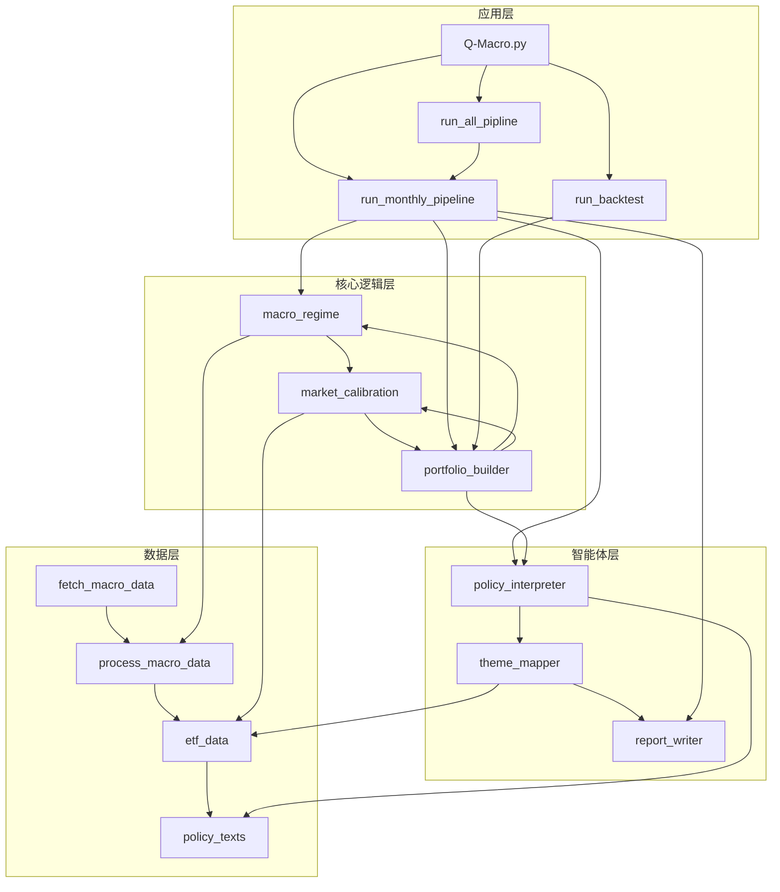

<div align="center">

# Q-Macro

**宏观驱动的ETF智能投资策略系统**

[](https://www.python.org/)
[](https://github.com/langchain-ai/langchain)
[](https://github.com/akfamily/akshare)
[](LICENSE)

</div>

---

## 目录

- [项目简介](#项目简介)
- [架构设计与技术选型](#架构设计与技术选型)
  - [系统架构](#系统架构)
  - [技术栈选择](#技术栈选择)
  - [核心依赖](#核心依赖)
- [核心功能模块](#核心功能模块)
  - [宏观状态识别](#宏观状态识别)
  - [政策主题提取](#政策主题提取)
  - [ETF智能打标](#etf智能打标)
  - [市场校准与拥挤度分析](#市场校准与拥挤度分析)
  - [动态资产配置](#动态资产配置)
  - [智能报告生成](#智能报告生成)
  - [回测与绩效评估](#回测与绩效评估)
- [数据说明](#数据说明)
  - [ETF数据](#etf数据)
  - [政策文本数据](#政策文本数据)
  - [宏观经济数据](#宏观经济数据)
- [开发环境配置](#开发环境配置)
  - [环境要求](#环境要求)
  - [依赖安装](#依赖安装)
  - [环境变量配置](#环境变量配置)
- [构建与运行流程](#构建与运行流程)
  - [一键运行完整流程](#一键运行完整流程)
  - [单模块运行](#单模块运行)
  - [回测流程](#回测流程)
- [关键技术实现](#关键技术实现)
  - [宏观状态四象限模型](#宏观状态四象限模型)
  - [LLM政策文本分析](#llm政策文本分析)
  - [ETF标签体系设计](#etf标签体系设计)
  - [动态权重分配算法](#动态权重分配算法)
  - [批量处理与并行计算](#批量处理与并行计算)
- [性能优化策略](#性能优化策略)
  - [数据缓存机制](#数据缓存机制)
  - [LLM调用优化](#llm调用优化)
  - [计算资源分配](#计算资源分配)
- [扩展性设计](#扩展性设计)
  - [数据源扩展](#数据源扩展)
  - [策略模块扩展](#策略模块扩展)
  - [回测框架扩展](#回测框架扩展)
  - [集成CUFEL-Q Arena](#集成cufel-q-arena)
- [部署与运维](#部署与运维)
  - [本地部署](#本地部署)
  - [容器化部署](#容器化部署)
  - [常见问题与排查](#常见问题与排查)
- [项目结构](#项目结构)
- [贡献指南](#贡献指南)
- [许可证](#许可证)
- [风险提示](#风险提示)

---

## 项目简介

Q-Macro是一个基于宏观经济数据和政策文件的ETF智能投资策略系统，旨在通过AI技术实现"宏观 → 政策 → 市场 → 资产配置"的完整投资决策链。系统采用模块化设计，结合量化分析与自然语言处理技术，为投资决策提供数据驱动的智能支持。

### 核心价值

- **数据驱动决策**：基于宏观经济指标和市场数据，避免情绪化投资
- **政策敏感度**：实时捕捉政策热点，提前布局受益板块
- **风险控制**：通过宏观状态识别和拥挤度分析，有效控制投资风险
- **智能自动化**：从数据获取到报告生成的全流程自动化
- **可解释性**：提供详细的投资决策归因分析，增强策略可信度

### 应用场景

- 机构投资者的宏观策略研究与资产配置辅助
- 个人投资者的ETF投资组合构建参考
- 金融教育与研究平台的策略演示
- 量化投资策略开发与回测

---

## 架构设计与技术选型

### 系统架构

Q-Macro采用分层架构设计，将系统分为数据层、核心逻辑层、智能体层和应用层四个主要层次，实现了数据处理、策略逻辑和应用服务的解耦。



### 技术栈选择

| 类别 | 技术/库 | 版本要求 | 用途 |
| :--- | :------ | :------- | :--- |
| 编程语言 | Python | 3.8+ | 核心开发语言 |
| 数据获取 | AKShare | 1.0+ | 宏观经济数据获取 |
| 自然语言处理 | LangChain | 1.2+ | LLM调用与管理 |
| 大语言模型 | Qwen/DeepSeek/Ollama | 兼容OpenAI接口 | 政策文本分析与报告生成 |
| 数据处理 | Pandas | 2.0+ | 时间序列数据处理 |
| 科学计算 | NumPy | 1.20+ | 数值计算与统计分析 |
| 可视化 | Matplotlib/Seaborn | 3.5+ | 回测结果可视化 |
| 回测框架 | GeneralBacktest | 自定义 | 策略回测与绩效评估 |
| 依赖管理 | uv | 0.1+ | 项目依赖管理 |

### 核心依赖

项目依赖通过`pyproject.toml`文件管理，主要包括：

- **数据处理**：pandas, numpy
- **网络请求**：requests
- **自然语言处理**：langchain, openai
- **数据可视化**：matplotlib, seaborn
- **配置管理**：python-dotenv
- **命令行工具**：click

---

## 核心功能模块

### 宏观状态识别

**功能说明**：基于PMI、CPI、PPI等宏观经济指标，构建四象限模型，识别当前经济所处的周期阶段（复苏、过热、滞胀、衰退）。

**实现方案**：
- 采用"增长-通胀"双维度划分经济状态
- 使用Z-score方法对指标进行标准化处理
- 基于历史数据阈值确定状态边界

**关键文件**：`src/core/macro_regime.py`

**输入/输出**：
- 输入：宏观经济指标数据（PMI、CPI、PPI）
- 输出：宏观状态标签、景气度评分

### 政策主题提取

**功能说明**：使用LLM分析政府文件和政策文本，提取关键政策主题，为行业配置提供指导。

**实现方案**：
- 基于LangChain框架调用大语言模型
- 采用关键词提取+主题聚类的分析方法
- 输出Top5政策主题及其影响力评分

**关键文件**：`src/agents/policy_interpreter.py`

**输入/输出**：
- 输入：政策文本数据
- 输出：政策主题列表、主题影响力评分

### ETF智能打标

**功能说明**：为ETF建立三级标签体系（资产类别/投资主题/子主题），实现ETF的智能分类与检索。

**实现方案**：
- 基于ETF名称、代码、持仓等信息进行标签生成
- 使用LLM进行文本分类和标签映射
- 建立标签权重体系，支持多标签分类

**关键文件**：`src/agents/theme_mapper.py`

**输入/输出**：
- 输入：ETF基本信息
- 输出：ETF标签数据（三级标签体系）

### 市场校准与拥挤度分析

**功能说明**：评估ETF的流动性和市场拥挤度，避免选择流动性差或过度拥挤的ETF。

**实现方案**：
- 基于成交量和成交额计算流动性指标
- 使用Z-score方法计算拥挤度指标
- 建立流动性和拥挤度的双维度筛选机制

**关键文件**：`src/core/market_calibration.py`

**输入/输出**：
- 输入：ETF量价数据
- 输出：ETF流动性评分、拥挤度评分

### 动态资产配置

**功能说明**：根据宏观状态、政策主题和市场状况，动态调整股票、债券、商品等资产类别的配置比例，并选择最优ETF组合。

**实现方案**：
- 基于宏观状态确定大类资产配置比例
- 根据政策主题调整行业配置权重
- 结合ETF流动性和拥挤度进行精细筛选
- 采用风险平价思想优化组合权重

**关键文件**：`src/core/portfolio_builder.py`

**输入/输出**：
- 输入：宏观状态、政策主题、ETF数据
- 输出：ETF投资组合（含权重）

### 智能报告生成

**功能说明**：自动生成月度投资策略报告，包括宏观经济分析、政策解读、组合构建逻辑和绩效归因。

**实现方案**：
- 基于模板和数据驱动的报告生成
- 使用LLM进行自然语言描述和分析
- 支持Markdown格式输出，便于阅读和分享

**关键文件**：`src/agents/report_writer.py`

**输入/输出**：
- 输入：宏观状态、政策主题、投资组合数据
- 输出：Markdown格式投资报告

### 回测与绩效评估

**功能说明**：对策略进行历史回测，计算关键绩效指标，生成可视化图表，评估策略的风险收益特征。

**实现方案**：
- 基于历史数据进行批量回测
- 计算累计收益率、年化收益率、最大回撤、夏普比率等指标
- 生成净值曲线、月度收益率、最大回撤等可视化图表
- 与基准组合进行对比分析

**关键文件**：`scripts/run_backtest.py`

**输入/输出**：
- 输入：历史ETF数据、策略生成的投资组合
- 输出：回测结果、绩效指标、可视化图表

---

## 数据说明

### ETF数据

**数据类型**：
- ETF基本信息数据：包含ETF代码、名称、跟踪指数等基础信息
- ETF量价数据：包含ETF的开盘价、最高价、最低价、收盘价、成交量、成交额等交易数据
- ETF标签数据：包含ETF的资产类别、投资主题、子主题等分类信息

**覆盖范围**：
- 本项目从A股市场随机抽样500只ETF产品作为数据演示，包括股票型、债券型、商品型和货币型ETF
- 包含宽基ETF和行业主题ETF
- 主要覆盖2025年量价数据

**使用方式**：
- 基本信息数据：用于ETF分类和标签生成
- 量价数据：用于市场校准和拥挤度分析
- 标签数据：用于投资组合构建和主题配置

**文件路径**：
- `data/etf/etf_basic.csv`：ETF基本信息
- `data/etf/etf_2025_ohlcva.csv`：ETF量价数据
- `data/etf/processed_etf_basic.csv`：LLM打标签结果
- `data/etf/tag_analysis.txt`：标签分析结果

### 政策文本数据

**文本来源**：
- 政府官方网站发布的政策文件和新闻稿
- 中央经济工作会议等重要会议纪要
- 监管部门发布的行业政策

**涵盖领域**：
- 宏观经济政策
- 产业发展政策
- 金融市场政策
- 科技创新政策
- 能源环保政策

**时间范围**：
- 主要覆盖2025年政策文件
- 支持扩展到其他年份的数据

**格式规范**：
- CSV格式存储，包含日期、标题、内容等字段
- 内容字段为政策文本的详细描述
- 编码格式为UTF-8

**使用方式**：
- 用于政策主题提取和分析
- 作为LLM模型的输入，识别政策支持的投资主题
- 为投资决策提供政策依据

**文件路径**：
- `data/policy_texts/govcn_2025.csv`：2025年政策文件

### 宏观经济数据

**具体数据指标**：
- PMI（采购经理指数）：反映制造业和非制造业的景气程度
- CPI（消费者价格指数）：反映通货膨胀水平
- PPI（生产者价格指数）：反映工业产品价格变化
- GDP增速：反映经济增长水平
- 货币供应量（M2）：反映市场流动性
- 社会融资规模：反映实体经济融资状况
- 利率数据：包括LPR、国债收益率等

**获取方法**：
- 通过AKShare库获取宏观经济数据
- 使用`scripts/fetch_macro_data.py`脚本自动获取
- 支持手动更新数据文件

**更新机制**：
- 月度数据：每月初更新上月数据
- 季度数据：每季度初更新上季度数据
- 年度数据：每年初更新上年度数据

**引用要求**：
- 引用数据时请注明数据来源为AKShare
- 商业用途请遵守相关数据使用协议
- 确保数据使用符合法律法规要求

**文件路径**：
- `data/macro_data/`：原始宏观经济数据
- `data/processed_macro_data/`：处理后的宏观数据

---

## 开发环境配置

### 环境要求

- **操作系统**：Windows 10+, macOS 10.15+, Linux
- **Python版本**：3.8+
- **依赖管理**：uv 0.1+ 或 pip 20.0+
- **网络连接**：需要互联网连接以获取数据和调用LLM API

### 依赖安装

使用uv（推荐）：

```bash
# 安装uv（如果未安装）
pip install uv

# 同步依赖
uv sync
```

使用pip：

```bash
# 安装依赖
pip install -e .
```

### 环境变量配置

复制`.env.example`文件为`.env`，并根据实际情况修改配置：

```env
# LLM API配置
LLM_API_KEY=your_api_key
MODEL_NAME=Qwen/Qwen3-Next-80B-A3B-Instruct
LLM_API_BASE=https://dashscope.aliyuncs.com/compatible-mode/v1

# 数据配置
DATA_DIR=data
ETF_DATA_DIR=data/etf
MACRO_DATA_DIR=data/macro_data
POLICY_DATA_DIR=data/policy_texts

# 输出配置
PORTFOLIO_DIR=portfolios
REPORT_DIR=reports
RESULTS_DIR=results

# 回测配置
BACKTEST_START_DATE=2025-01-01
BACKTEST_END_DATE=2025-12-31
BENCHMARK_SYMBOL=159925
```

---

## 构建与运行流程

### 一键运行完整流程

执行完整的策略生成、回测流程：

```bash
# 执行完整流程：数据获取 → 策略生成 → 回测分析
python Q-Macro.py

# 仅运行回测（使用已生成的投资组合）
python Q-Macro.py --only-backtest

# 仅生成策略（跳过回测）
python Q-Macro.py --skip-backtest
```

### 单模块运行

**数据获取**：

```bash
# 获取宏观经济数据
python scripts/fetch_macro_data.py

# 处理宏观经济数据
python scripts/process_macro_data.py
```

**ETF标签生成**：

```bash
# 为ETF打标签
python -m src.agents.theme_mapper
```

**政策分析**：

```bash
# 分析政策文件
python -m src.agents.policy_interpreter
```

**单月策略生成**：

```bash
# 生成指定月份的投资组合
python scripts/run_monthly_pipeline.py --date 2025-12-31
```

### 回测流程

```bash
# 转换投资组合为回测格式
python scripts/parse_portfolios_to_csv.py

# 运行回测
python scripts/run_backtest.py
```

---

## 关键技术实现

### 宏观状态四象限模型

**实现原理**：基于PMI（经济增长）和CPI（通胀）的组合，将经济状态划分为四个象限：

- **复苏**：PMI↑，CPI↓ → 股票表现好
- **过热**：PMI↑，CPI↑ → 商品表现好
- **滞胀**：PMI↓，CPI↑ → 现金表现好
- **衰退**：PMI↓，CPI↓ → 债券表现好

**技术细节**：
- 使用滚动窗口计算指标的变化率
- 采用Z-score标准化处理，消除量纲影响
- 基于历史分位数确定状态转换阈值

### LLM政策文本分析

**实现原理**：利用大语言模型对政策文本进行语义理解和信息提取，识别政策重点支持的行业和领域。

**技术细节**：
- 采用LangChain框架管理LLM调用
- 使用系统提示（System Prompt）引导模型输出结构化信息
- 实现文本分块处理，支持长文档分析
- 采用关键词频率统计和相关性分析验证模型输出

### ETF标签体系设计

**实现原理**：构建三级标签体系，对ETF进行多维度分类，便于快速定位符合投资主题的ETF。

**技术细节**：
- 一级标签：资产类别（股票、债券、商品等）
- 二级标签：投资主题（科技、消费、医药等）
- 三级标签：子主题（AI、新能源、创新药等）
- 使用LLM对ETF名称、代码、持仓进行分析，自动生成标签
- 建立标签置信度评分，支持模糊匹配

### 动态权重分配算法

**实现原理**：根据宏观状态、政策主题和市场状况，动态调整资产配置权重，优化风险收益特征。

**技术细节**：
- 基于宏观状态确定大类资产的基础配置比例
- 根据政策主题热度调整行业配置权重
- 结合ETF流动性和拥挤度进行权重校准
- 采用风险平价思想，根据资产波动率调整权重
- 实现权重约束，确保组合的分散性和可交易性

### 批量处理与并行计算

**实现原理**：对多月份数据进行批量处理，提高系统运行效率。

**技术细节**：
- 使用Python的multiprocessing模块实现并行计算
- 采用任务分解策略，将不同月份的计算任务分配给不同进程
- 实现数据缓存机制，避免重复计算
- 采用进度条显示，提升用户体验

---

## 性能优化策略

### 数据缓存机制

- **实现方式**：对获取的宏观数据和ETF数据进行本地缓存
- **优化效果**：减少重复网络请求，提高数据获取速度
- **应用场景**：多次运行策略时，避免重复下载数据

### LLM调用优化

- **实现方式**：
  - 批量处理文本，减少API调用次数
  - 优化提示词，提高模型输出质量和速度
  - 实现LLM响应缓存，避免相同输入的重复计算
- **优化效果**：减少LLM调用时间和成本
- **应用场景**：政策文本分析和报告生成

### 计算资源分配

- **实现方式**：
  - 根据任务类型分配计算资源
  - 对CPU密集型任务使用多进程
  - 对IO密集型任务使用多线程
- **优化效果**：充分利用系统资源，提高计算效率
- **应用场景**：批量回测和数据处理

---

## 扩展性设计

### 数据源扩展

- **设计原则**：采用适配器模式，支持多种数据源
- **扩展方式**：
  - 实现新的数据源适配器
  - 统一数据格式接口
  - 支持本地数据和API数据
- **应用场景**：添加美国利率数据、原油价格数据等

### 策略模块扩展

- **设计原则**：采用插件架构，支持策略模块的热插拔
- **扩展方式**：
  - 实现新的策略模块接口
  - 注册到策略管理器
  - 配置策略参数
- **应用场景**：添加行业轮动策略、因子模型等

### 回测框架扩展

- **设计原则**：采用抽象工厂模式，支持多种回测引擎
- **扩展方式**：
  - 实现新的回测引擎适配器
  - 统一回测结果格式
  - 支持不同的绩效指标计算
- **应用场景**：集成第三方回测框架，如PyAlgoTrade、Backtrader等

### 集成CUFEL-Q Arena

- **设计原则**：模块化封装，支持与CUFEL-Q Arena平台集成
- **集成方式**：
  - 安装cufel-arena-agent包
  - 实现ETFAgentBase接口
  - 封装Q-Macro核心逻辑
  - 配置参赛参数
- **应用场景**：参加CUFEL-Q Arena比赛，与其他策略进行对比

---

## 部署与运维

### 本地部署

1. **环境准备**：安装Python 3.8+和必要的依赖
2. **数据准备**：确保数据目录结构完整，首次运行会自动创建
3. **配置文件**：根据实际情况修改.env文件
4. **运行测试**：执行`python Q-Macro.py --only-backtest`测试回测功能
5. **监控日志**：查看运行日志，确保各模块正常工作

### 容器化部署

**Dockerfile示例**：

```dockerfile
FROM python:3.10-slim

WORKDIR /app

COPY . .

RUN pip install --no-cache-dir uv && \  
    uv sync

COPY .env.example .env

CMD ["python", "Q-Macro.py"]
```

**构建与运行**：

```bash
# 构建镜像
docker build -t q-macro .

# 运行容器
docker run --env-file .env -v ./data:/app/data -v ./results:/app/results q-macro
```

### 常见问题与排查

| 问题 | 可能原因 | 解决方案 |
| :--- | :------- | :------- |
| 运行时提示缺少API Key | 未配置.env文件 | 在.env文件中添加LLM_API_KEY |
| 回测结果为空 | 未生成投资组合 | 先运行完整流程生成投资组合，再运行回测 |
| 项目运行缓慢 | LLM调用耗时较长 | 使用--only-backtest参数跳过LLM步骤，或使用更快的LLM模型 |
| ETF标签错误 | LLM分类不准确 | 手动修正processed_etf_basic.csv文件，或改进theme_mapper.py中的提示词 |
| 数据获取失败 | 网络连接问题或API限制 | 检查网络连接，使用缓存数据，或更换数据源 |

---

## 项目结构

```text
Q-Macro/
├── data/                  # 数据目录
│   ├── etf/               # ETF数据
│   │   ├── etf_2025_ohlcva.csv        # ETF量价数据
│   │   ├── etf_basic.csv              # ETF基本信息
│   │   ├── processed_etf_basic.csv     # LLM打标签结果
│   │   └── tag_analysis.txt           # 标签分析结果
│   ├── macro_data/        # 宏观经济数据
│   ├── processed_macro_data/ # 处理后的宏观数据
│   └── policy_texts/      # 政策文本数据
│       └── govcn_2025.csv              # 2025年政策文件
├── src/                   # 核心源码
│   ├── core/              # 核心逻辑模块
│   │   ├── macro_regime.py        # 宏观状态识别
│   │   ├── market_calibration.py  # ETF流动性与拥挤度校准
│   │   └── portfolio_builder.py   # 动态组合构建
│   └── agents/            # AI智能体模块
│       ├── policy_interpreter.py  # 政策文本分析
│       ├── theme_mapper.py        # ETF标签生成
│       └── report_writer.py       # 投资报告生成
├── scripts/               # 可执行脚本
│   ├── fetch_macro_data.py        # 宏观数据获取
│   ├── process_macro_data.py      # 宏观数据处理
│   ├── run_monthly_pipeline.py    # 单月策略执行
│   ├── run_all_pipline.py         # 批量策略执行
│   ├── parse_portfolios_to_csv.py # 投资组合格式转换
│   └── run_backtest.py            # 回测执行
├── portfolios/            # 投资组合输出
├── reports/               # 投资报告输出
├── results/               # 回测结果
│   └── backtest_results/  # 回测详细结果
│       ├── charts/        # 回测图表
│       ├── metrics.txt    # 回测指标
│       ├── nav_series.csv # 净值序列
│       ├── positions.csv  # 持仓记录
│       └── trade_records.csv # 交易记录
├── 开发Prompt/            # 开发过程记录
├── Q-Macro.py             # 一键运行入口
├── README.md              # 项目说明
├── .env.example           # 环境变量示例
├── .gitignore             # Git忽略文件
├── pyproject.toml         # 项目配置文件
└── uv.lock                # 依赖锁定文件
```

---

## 贡献指南

我们欢迎社区贡献，包括但不限于：

1. **代码贡献**：修复bug、添加新功能、优化性能
2. **文档改进**：完善文档、添加示例、翻译文档
3. **功能建议**：提出新功能或改进建议

### 贡献流程

1. Fork本仓库
2. 创建功能分支 (`git checkout -b feature/amazing-feature`)
3. 提交更改 (`git commit -m 'Add some amazing feature'`)
4. 推送到分支 (`git push origin feature/amazing-feature`)
5. 打开Pull Request

### 代码规范

- 遵循PEP 8代码风格
- 为新功能添加测试
- 确保所有测试通过
- 添加适当的文档字符串

---

## 许可证

本项目采用MIT许可证，详见[LICENSE](LICENSE)文件。

---

## 风险提示

本项目所展示的所有策略回测、持仓记录及投资理念仅用于学术研究、教学演示与技术探索，不构成任何投资建议。历史回测表现不代表未来收益，市场有风险，投资需谨慎。本项目未开展任何实盘交易、代客理财或证券投资咨询业务，亦未向公众募集资金。请勿将本项目内容作为实际投资决策依据。