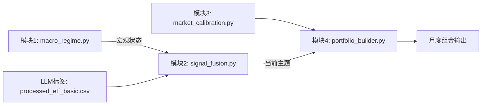

# Q-Macro 模块集成方案 — 从硬编码到 LLM 赋能

## 目标

将 LLM 打标的 `processed_etf_basic.csv` 无缝集成到现有策略主干，实现 **动态主题轮动 + 多资产配置**。

---

## 一、整体集成架构



### 关键变化

- **移除硬编码关键词**（`AI_THEME_KEYWORDS`）
- **新增模块2**：决定"当前该用什么主题"
- **模块4读取LLM标签**，按资产大类+主题筛选ETF

---

## 二、各模块修改清单

### 1. 模块4：portfolio_builder.py 升级

#### 修改点

- **输入路径变更**：
  ```python
  # 旧
  etf_meta_path = "data/etf/etf_basic.csv"
  # 新
  etf_meta_path = "data/etf/processed_etf_basic.csv"
  ```

- **ETF筛选逻辑重构**：

  | 筛选类型 | 旧逻辑 | 新逻辑 |
  | :------- | :----- | :----- |
  | 宽基ETF | `index_name` 含关键词 | `asset_class=="股票" and theme in ["大盘宽基", "中盘宽基", "小盘宽基", "全市场宽基"]` |
  | 主题ETF | `index_name/csname` 含 AI 关键词 | `asset_class=="股票" and theme == current_theme` |
  | 债券ETF | 硬编码 `"511260"` | `asset_class=="债券"`（可选子主题） |
  | 商品ETF | 硬编码 `"518880"` | `asset_class=="商品"`（可选子主题） |

- **新增参数**：
  ```python
  def build_portfolio(
      macro_state: dict,
      market_cond: dict,
      current_theme: str = None,  # 新增：由模块2提供
      etf_meta_path: str = "data/etf/processed_etf_basic.csv"
  ):
  ```

#### 行为变化

- 若 `current_theme is None`：不配主题ETF，股票全配宽基
- 若 `current_theme` 有效：按 60%宽基 + 40%×拥挤因子 配置

---

### 2. 新增模块2：signal_fusion.py

#### 路径

`src/core/signal_fusion.py`

#### 功能

- 输入：宏观状态 + 宏观数据（如 LPR、社融）
- 输出：`{"use_thematic": bool, "recommended_theme": str}`

#### 初版规则（硬编码，后续由 LLM 替代）

```python
def decide_theme(macro_state: dict, macro_data_dir: str) -> dict:
    regime = macro_state["regime"]
    score = macro_state["equity_friendly_score"]
    
    # 复苏期且权益友好度高 → 启用主题
    if regime == "recovery" and score > 0.6:
        return {"use_thematic": True, "recommended_theme": "人工智能"}
    elif regime == "overheat":
        return {"use_thematic": True, "recommended_theme": "周期"}
    else:
        return {"use_thematic": False, "recommended_theme": None}
```

#### 为什么先硬编码？

- 快速验证 LLM 标签可用性
- 为后续 `policy_interpreter.py` 提供输入模板

---

### 3. 主流程脚本：run_monthly_pipeline.py

#### 路径

`scripts/run_monthly_pipeline.py`

#### 执行流程

```python
from src.core.macro_regime import detect_macro_regime_and_score
from src.core.market_calibration import calibrate_etf_market_conditions
from src.core.signal_fusion import decide_theme
from src.core.portfolio_builder import build_portfolio

def run_monthly(target_date: str):
    # 1. 宏观状态
    macro = detect_macro_regime_and_score(target_date)
    
    # 2. 市场校准
    market = calibrate_etf_market_conditions(target_date)
    
    # 3. 主题决策
    theme_decision = decide_theme(macro, "data/processed_macro_data")
    current_theme = theme_decision["recommended_theme"]
    
    # 4. 构建组合
    portfolio = build_portfolio(
        macro_state=macro,
        market_cond=market,
        current_theme=current_theme
    )
    
    return portfolio
```

---

## 三、策略行为升级对比

| 场景 | 旧策略（硬编码） | 新策略（LLM标签） |
| :--- | :--------------- | :---------------- |
| **复苏期** | 固定配 AI ETF | 可配 "人工智能"、"高端制造"、"数字经济" |
| **过热期** | 固定配 AI ETF | 可配 "周期"、"金融"、"新能源车" |
| **滞胀期** | 不配主题 | 不配主题（或未来配 "黄金"） |
| **宽基选择** | 仅沪深300 | 可选大盘/中盘/小盘/全市场 |
| **债券选择** | 仅国债ETF | 可选利率债/信用债/可转债 |

### 核心价值

**同一套代码，支持 N 种主题轮动策略**

---

## 四、实施步骤

### 步骤 1：更新 `portfolio_builder.py`

- 替换 ETF 读取路径
- 重写筛选逻辑（使用 `asset_class` 和 `theme` 字段）
- 添加 `current_theme` 参数

### 步骤 2：创建 `signal_fusion.py`

- 实现初版 `decide_theme`（硬编码规则）
- 支持未来扩展（如读取 LPR 判断宽松）

### 步骤 3：编写 `run_monthly_pipeline.py`

- 串联四大模块
- 添加日志输出

### 步骤 4：测试全流程

```bash
# 示例：2025年12月策略
python scripts/run_monthly_pipeline.py --date 2025-12-31
```

---

## 五、风险控制

| 风险 | 应对措施 |
| :--- | :------- |
| LLM 标签错误 | `portfolio_builder` 中添加 `if theme not in ALLOWED_THEMES: skip` |
| 主题ETF缺失 | 自动 fallback 到宽基（已有逻辑） |
| 模块2未就绪 | `current_theme=None` 时走纯宽基路径 |

---

## 六、后续演进路径

1. **短期**：硬编码 `signal_fusion` + LLM 标签 → 验证多主题可行性
2. **中期**：用 `policy_interpreter.py` 替代 `signal_fusion` → 从政策文本提取主题
3. **长期**：`report_writer.py` 生成归因报告 → 解释"为何选此主题"

---

此方案让策略 **立即获得 LLM 赋能**，同时保持硬编码主干的稳定性。所有修改均为**增量式、可回滚**。

是否需要生成 **`signal_fusion.py` 和 `run_monthly_pipeline.py` 的完整代码**？